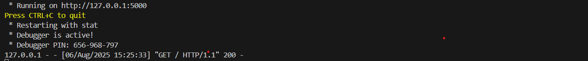

# Bank Haolim Loan Application Analysis

Welcome to the Bank Haolim loan application presentation repository.

## Project Overview

The goal of this project is to analyze how various factors influence loan approval decisions at Bank Haolim, using a loan dataset inspired by Kaggle.

We explore the data, create key performance indicators (KPIs), build predictive models, and provide a deployment solution with an API for loan approval prediction.

**Data source:** Kaggle loan dataset

The main dataset used in this project is "train.csv", which contains information related to loan applications, including demographic data, financial details, and loan approval status.
After performing preprocessing steps — such as handling missing values, encoding categorical features, and removing outliers — a clean version of the dataset was created and saved as df2.

Additional engineered variables were added to df2 to support deeper analysis and modeling. This cleaned and enriched dataset (df2) was exported to a separate file and re-imported during the KPI calculation and data visualization phase.

---
## Project Outline

1. **Data Understanding : 0_Data_understanding.ipynb** 
   Gain insights into the dataset, variables, and data quality.

2. **Exploratory Data Analysis : 1_EDA.ipynb**  
   Visualize and summarize the data to uncover patterns and relationships.

3. **Data Preprocessing : 2_Preprocessing.ipynb**  
   Clean the data, handle missing values, encode categorical variables, and prepare features for modeling.

4. **Key Performance Indicators : 3_KPI.ipynb**  
   Define and calculate relevant KPIs to evaluate loan applicant profiles and approval trends.

5. **Modeling : 4_Modeling.ipynb**  
   Build machine learning models to predict loan approval status.

## How to Use This Repository

- **Step 1** : Download the raw dataset ***train.csv*** and run scripts ***0_Data_understanding.ipynb***, ***1_EDA.ipynb***, and ***2_Preprocessing.ipynb*** for data exploration and preprocessing.
- **Step 2** : Then, download the cleaned and enriched dataset ***df2.csv*** and run scripts ***3_KPI.ipynb*** and ***4_Modeling.ipynb*** to train and use the predictive model.

# Local Flask Application

This application is a simple example of a local API with a small Python model and HTML pages.  
It allows the user to submit data via a form and returns either an acceptance or a rejection based on the rule defined in `model.py`.  

---

## **Project Structure**

mon_projet/
│
├── api.py          # Main program that runs the Flask application
├── model.py        # Contains the model or business logic
│
└── templates/      # Folder containing HTML templates
    ├── form.html
    ├── valid.html
    └── refused.html

- **`api.py`**: Starts the Flask server and handles the routes.  
- **`model.py`**: Contains the logic to validate or reject the input.  
- **`templates/`**: Contains the HTML files rendered in the browser.  

## **How It Works**

- Open the homepage to submit data through the form.  
- Depending on the rule in `model.py`:  
  - If the data is **valid**, `valid.html` is displayed.  
  - If the data is **rejected**, `refused.html` is displayed.  

